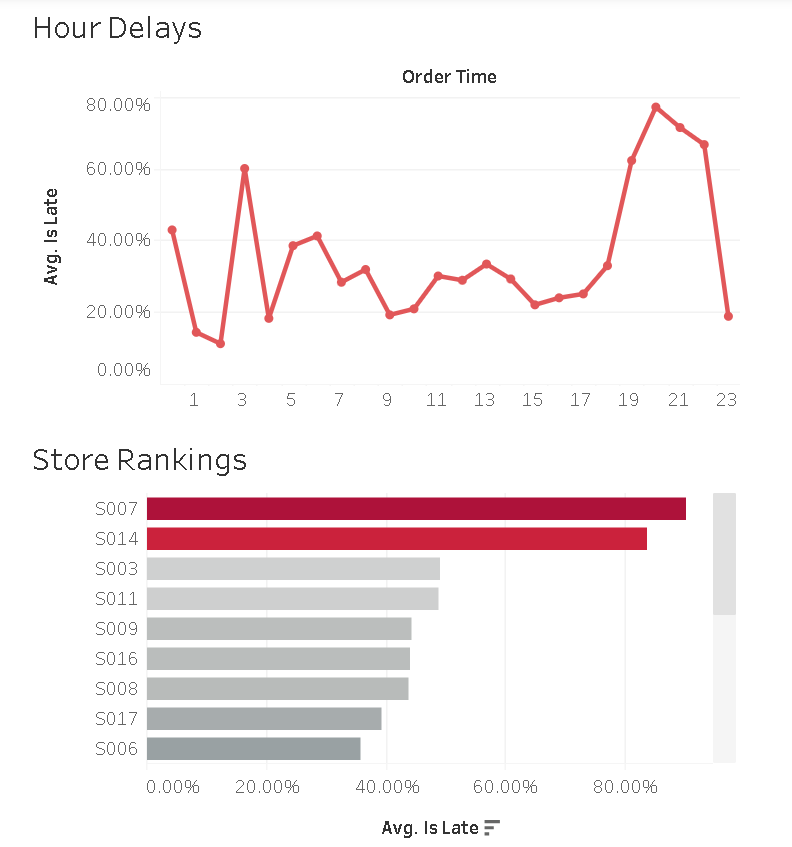

# 📊 Blinkit SLA Diagnostic Dashboard — Tableau Architecture

> **Explore the Interactive Dashboard:**  
> 🔗 **[View the Live SLA Diagnostic Dashboard on Tableau Public](https://public.tableau.com/views/Blinkit-SLA-Diagnostic-Dashboard/Dashboard1?:language=en-US&publish=yes&:sid=&:redirect=auth&:display_count=n&:origin=viz_share_link)**

[]([PASTE-YOUR-TABLEAU-LINK-HERE](https://public.tableau.com/views/Blinkit-SLA-Diagnostic-Dashboard/Dashboard1?:language=en-US&publish=yes&:sid=&:redirect=auth&:display_count=n&:origin=viz_share_link))

---

## 🎯 Executive Summary
While aggregate speed metrics suggest acceptable operational performance (averaging **9.68 minutes** per delivery across **1,701 clean orders**), granular visual diagnostics reveal an overall **SLA failure rate of 39.56%**. 

This dashboard was engineered to shift operations management from static spreadsheet reporting to an interactive diagnostic model. It isolates the exact hours and fulfillment centers driving network delays, proving that the 10-minute delivery promise breaks down during specific peak demand windows.

---

## ⚙️ Technical Architecture & Calculated Fields
To transform raw order timestamps into diagnostic KPIs, three foundational calculated fields were constructed in Tableau:

### 1. SLA Breach Flag (`Is Late`)
A binary flag used to separate compliant deliveries from SLA violations without altering underlying timestamp data.
```sql
IF [delivery_minutes] > 10 THEN 1 ELSE 0 END
```

### 2. SLA Failure Rate (`% Late`)
An aggregation formula converting the binary delay flags into a dynamic network-wide failure percentage, formatted to two decimal places.
```sql
SUM([Is Late]) / COUNT([orders_clean.csv])
```

### 3. Order Hour Extraction (`Order Hour`)
An integer extraction from the ISO-8601 timestamp to group deliveries into 24 distinct daily operating windows.
```sql
DATEPART('hour', [order_time])
```

---

## 📈 Visual Evidence & Diagnostic Charts

### 1. The Evening Rush Collapse (Hourly Line Chart)
* **What it shows:** SLA failure rates mapped across the 24-hour daily operating cycle.
* **Key Finding:** On-time performance collapses sharply between **8:00 PM and 10:00 PM (Hours 20–22)**. While morning and afternoon deliveries reliably hit the 10-minute target, evening order volume overwhelms fulfillment capacity, causing failure rates to spike.

### 2. The Dark Store Leaderboard (Horizontal Bar Chart)
* **What it shows:** All fulfillment centers sorted descending by their average SLA failure rate, utilizing a divergent red-to-gray color palette to immediately flag bottlenecks.
* **Key Finding:** Network delays are not distributed evenly. Store **S007 (88.89% failure rate)** and Store **S014 (77.78% failure rate)** operate as severe operational bottlenecks, failing on the vast majority of their assigned orders.

### 3. Geographical Split (Mumbai vs. Bengaluru)
* **What it shows:** A macro-level comparison of SLA compliance across primary metropolitan markets.
* **Key Finding:** Mumbai experiences a higher overall SLA breach rate (**41.87%**) compared to Bengaluru (**37.17%**), indicating higher localized traffic density or inadequate rider allocation during peak hours.

---

## 🖱️ Interactive Design Features
* **Dynamic Store Filtering:** The Dark Store Leaderboard is configured as an interactive dashboard filter (`Use as Filter`). Clicking any individual warehouse bar (such as **S007**) dynamically isolates that center's specific hourly delay curve and KPI banner metrics.
* **Clean Tooltips:** Default database text was replaced with human-readable operational tags utilizing dynamic measure insertions (`<AGG(Avg. Is Late)>`).
* **De-cluttered Canvas:** Background gridlines, zero lines, and redundant axis labels were stripped away to maximize data-ink ratio and ensure readability on mobile and desktop browsers.
